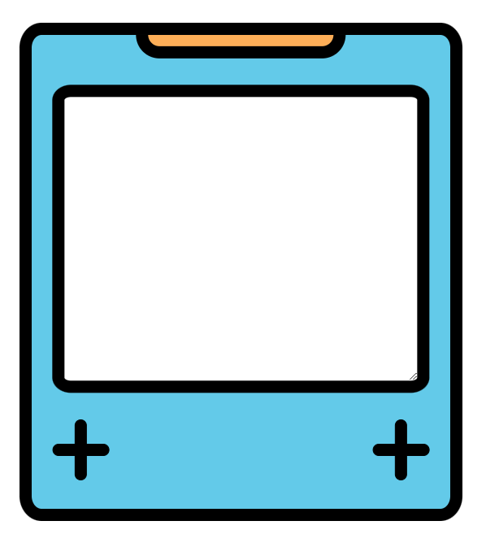

# bitcode

A small app that helps me study syntax programming with the Anki app.

## Table of contents

- [Overview](#overview)
  - [Screenshot](#screenshot)
  - [Links](#links)
- [My procces](#my-process)
  - [Build with](#build-with)
  - [What's about it](#what-is-about-it)
  - [Continued development](#continued-development)
- [Author](#author)

## Overview

### Screenshot

### Links

- Solution URL: [Repo](https://github.com/Divano-coder/bitcode)
- Live Site URL: [Git-hub pages](https://divano-coder.github.io/bitcode/)

## My process

### Build with

- Semantic HTML5 markup
- CSS custom properties
- Flexbox

### What is about it

This simple app helps me solve the small problem that, when I wrote the answer in a simple .txt file aside the Anki screen, I needed a new white space to write the next answer, and it took too long scrolling the page or erasing my last answer.

That's because I developed this small app to help me. When I write an answer for an Anki question, as I move to the next one, I just press Ctrl + Enter, and the answer is erased.

Now it's very easy for me to advance in my studies.

### Continued development

I will continue developing other kinds of apps very soon, making them more complex and larger with each project. These apps will help me increase my experience and capacity in this incredible tech world.

## Author

- Git-hub - [Divano-coder](https://github.com/Divano-coder)
